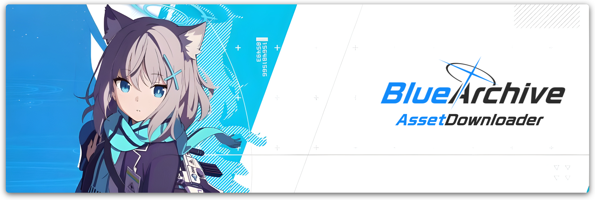

<div align="center">
  
  <h1>Blue Archive - Asset Downloader</h1>
</div>

A tool that downloads the latest **Blue Archive** assets.

## Building
> If you want to try it out, you can build it yourself. Note that this is still a work in progress and something will break.

1. Install [rustup](https://rustup.rs)
2. Clone this repository
```sh
git clone https://github.com/Deathemonic/BA-AD -b rust
```
3. Build using `cargo`
```sh
cargo build
```

## Using as a library
> Add this line in your `Cargo.toml`
```toml
baad = { git = "https://github.com/Deathemonic", branch = "rust" }
```


### TODO
- [X] Add global support
- [X] Multithreading download support
- [X] Add the asset downloader
- [X] ~UI and colorful messages~
- [ ] Add ~search mode~ and filter mode
- [ ] ~Add extract media zips~
- [ ] ~Add extract table zips, and db (low priority)~
- [ ] ~Add extract assetbundle (low priority)~
- [ ] ~Add download old apks~
- [X] Replace the download manager with another library
- [ ] Restructure codebase as an asset downloader only
- [ ] Expose functions to act as a library
- [X] Remove the UI
- [ ] Add CLI stuff


### FAQ

Why the switch to rust?
- baad is getting slow, and I want to learn rust, so I decided to make baad in rust and might as well add new stuff that I didn't add before like Global asset download.

Why a library?
- This helps the process of porting baad to another project.
Instead of rewriting or passing as an executable, this exposes functions so you can implement the functions easily.
This also helps when porting to another language because you can bind it with `Cdylib` 

Why no UI?
- It just makes the project more complex.
The main goal is to make a simple CLI/Library to download Blue Archive assets.
The UI can be implemented on another project like BA-AD-GUI.