<div align="center">
  
  <h1>Blue Archive - Asset Downloader</h1>
</div>

A tool that downloads and extracts the **Blue Archive JP** `AssetBundles`, `TableBundles`, `MediaResources`.

It downloads them directly from the **Yostar Servers**.

## Requirements
- Python 3.10+
- .Net Runtime 6.0 (If you are using GNU/Linux or MacOS)

<details>
  <summary>Libraries Used (Click to expand)</summary>
<br>

- aiohttp
- aiofiles
- requests
- requests-cache
- cloudscraper
- flatbuffers
- pycryptodome
- UnityPy
- rich
- xxhash

</details>

## Installation
Download and install [`python`](https://www.python.org/downloads/). After that clone this repository

```
git clone https://github.com/Deathemonic/BA-AD
```

or just download as a zip by clicking `Code` > `Download Zip`. Then open `BA-AD` folder in your `Terminal` or `CMD`

Then install it using pip

```
pip install .
```

<details>
	<summary>Tutorial with Screenshots (Click to expand)</summary>
<br>

1. Download the repository files

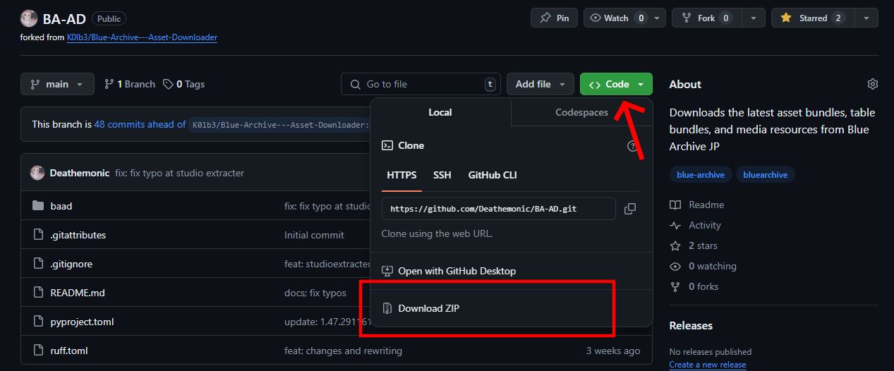

2. Extract the downloaded zip and open the folder from the extracted zip

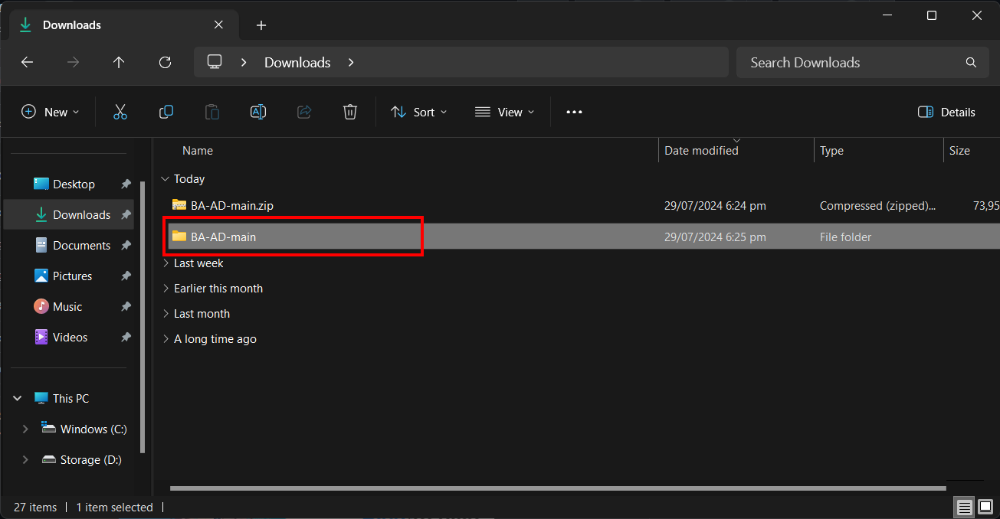

3. `Shift` + `Right Click` then click `Open PowerShell window here`

_alternatively you can open cmd then change directory to the folder_

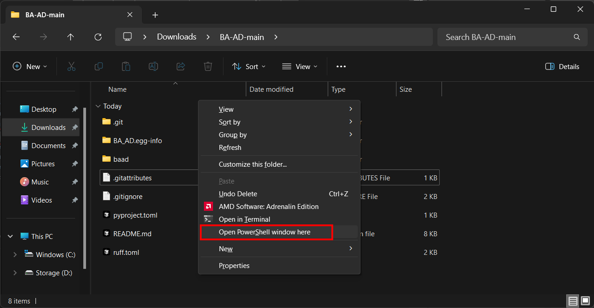

4. Install the program by typing `pip install .`

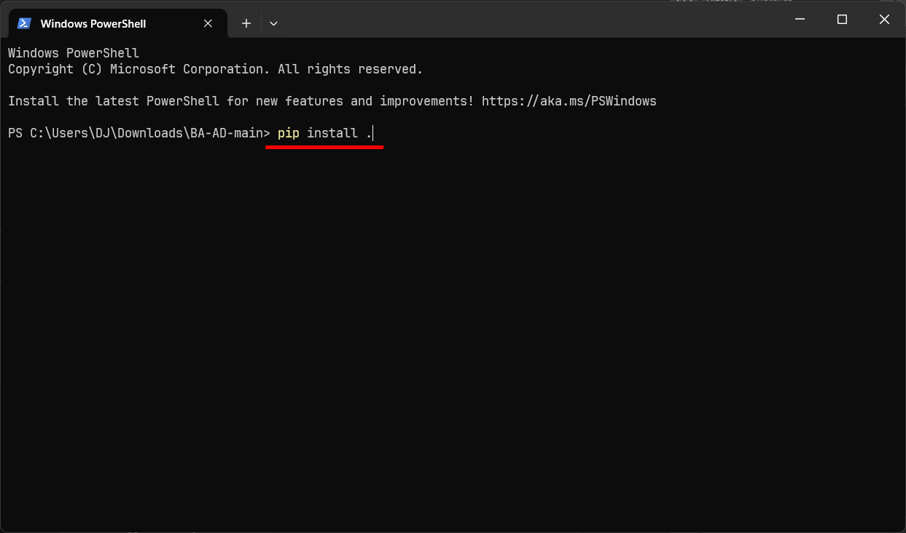


5. Your done just type `baad --help` to see the usage. Check out [Usage](#usage) on how to use the tool.

<br>

<details>
  <summary>Example Usage (Click to expand)</summary>
<br>

- Downloads the assetbundles
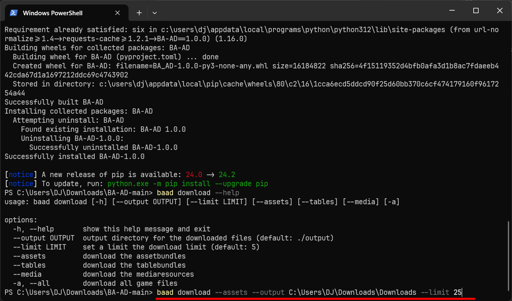
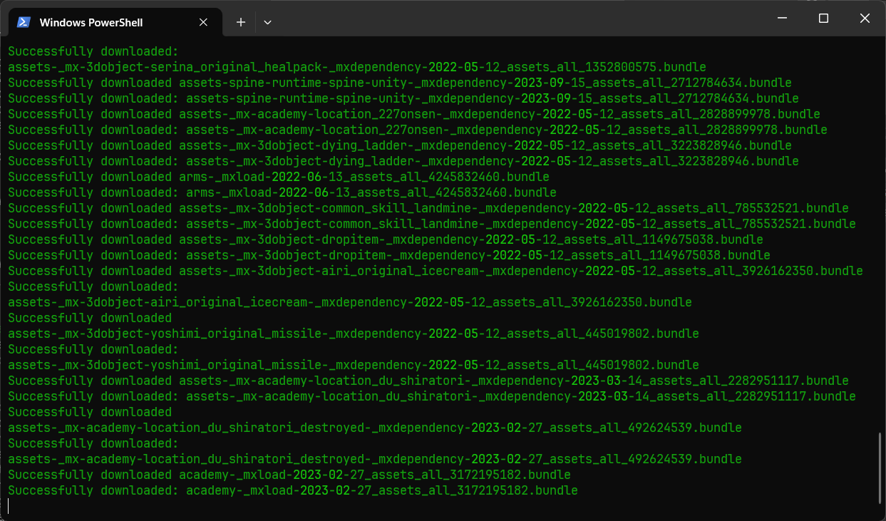

- Downloads the tablebundles
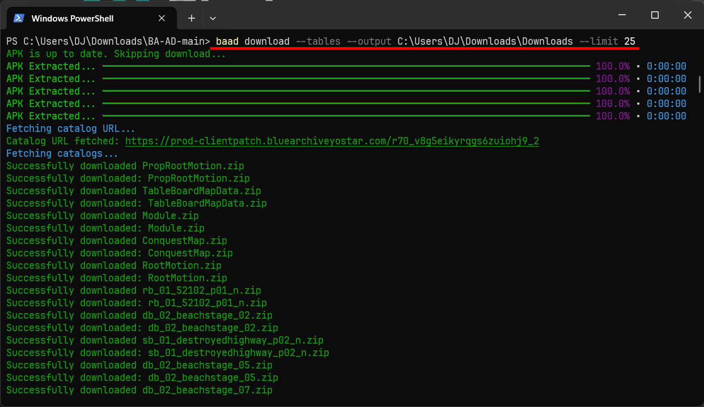

- Downloads the media reasources
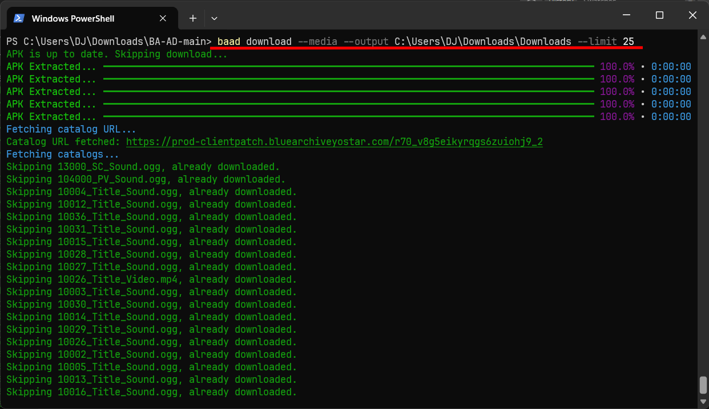

- Output results
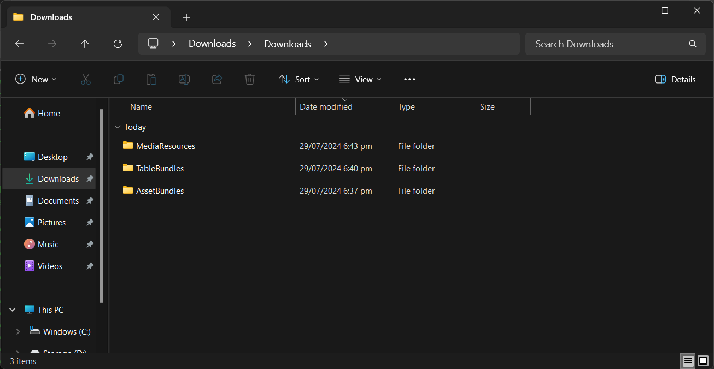
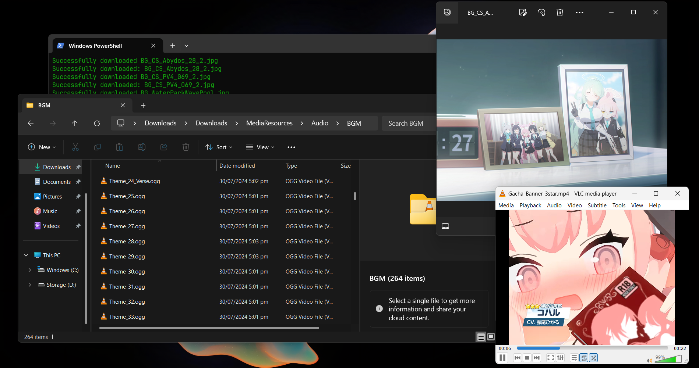

- Extracting assetbundles
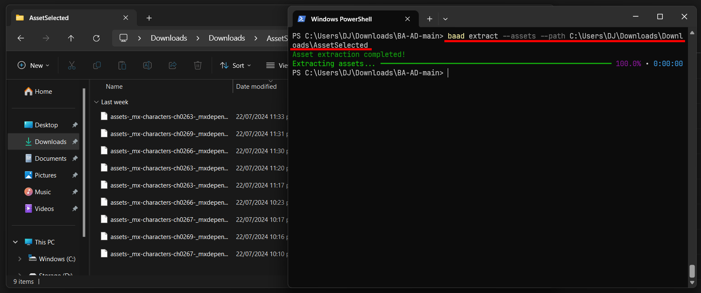
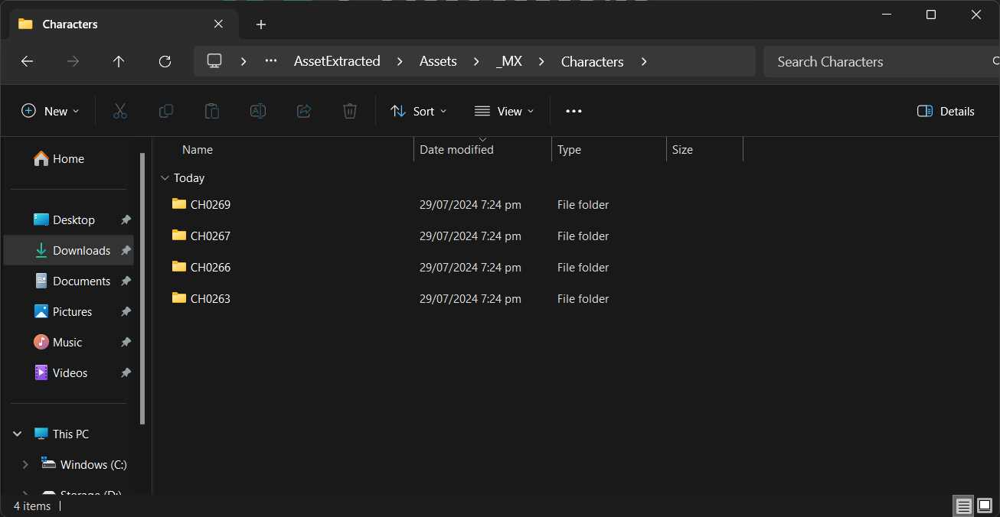

- Extracting tablebundles
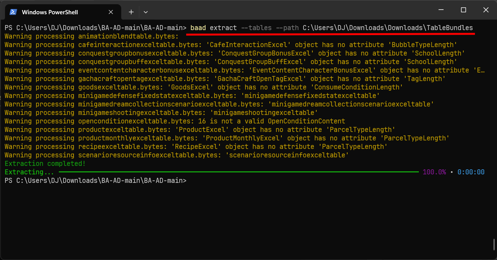

</details>


</details>

## Usage

> [!IMPORTANT]
> Before you go downloading the game assets please read [Nexon's Terms and Service](https://m.nexon.com/terms/304) first. You are not allowed to sell the game files, models or use them for commercial purposes.

```
> baad --help
usage: baad [-h] [-v] [-u] [-g] {download,extract} ...

Blue Archive Asset Downloader

positional arguments:
  {download,extract}
    download          download game files
    extract           extract game files

options:
  -h, --help          show this help message and exit
  -v, --version       show program's version number and exit
  -u, --update        force update the apk
  -g, --generate      generate the flatbuf schema
```

#### Downloading

To download the assetsbundles, tablebundles, and media resources we need to initialize download mode, to do that we pass `download` so it will be like this `baad download`.

```
> baad download --help
usage: baad download [-h] [--output OUTPUT] [--limit LIMIT] [--catalog CATALOG] [--assets] [--tables] [--media] [-a]

options:
  -h, --help         show this help message and exit
  --output OUTPUT    output directory for the downloaded files (default: ./output)
  --limit LIMIT      set a limit the download limit (default: 5)
  --catalog CATALOG  force change the catalog url (will skip apk download)
  --assets           download the assetbundles
  --tables           download the tablebundles
  --media            download the mediaresources
  -a, --all          download all game files
```

You can pass `--update` to force update the game version.

```
> baad --update
```

Examples:

- Saves the files using Posix Path style
```
> baad download --tables --output ./Downloads
```

- Limit the concurrent download to 10 files
```
> baad download --assets --limit 10
```

- Downloads both `AssetBundles` and `MediaResources`
```
> baad download --assets --media
```

- Saves the files using Windows Path style
```
> baad download --media --output C:\Users\User\Documents
```

- Change the catalog url to a older catalog url
```
> baad download --assets --catalog https://prod-clientpatch.bluearchiveyostar.com/r67_jjjg51ngucokd90cuk4l_3
```

> [!NOTE]
> If you have low connection and download say error, rerun the program again it will retry downloading the remaining files. Don't worry it will not download the already downloaded files again

#### Extracting

To extract the assetsbundles, and  tablebundles we need to initialize extract mode, to do that we pass `extract` so it will be like this `baad extract`.

No need to extract the `MediaResources` as it's already extracted by default.

```
> baad extract --help

usage: baad extract [-h] [--path PATH] [--studio] [--assets] [--tables] [-a]

options:
  -h, --help   show this help message and exit
  --path PATH  path of the files that will be extracted
  --studio     uses the assetstudiomod as a backend for extracting the assetbundles
  --assets     extract the assetbundles
  --tables     extract the tablebundles
  -a, --all    extract all game files
```
<br>

<details open>
	<summary>AssetBundles</summary>
<br>

  To extract assetbundles you need to pass `--assets` to extract the asset then pass `--path` to specify the path to extract the assetbundles. This will extract the assets files to the parent path folder then `AssetExtracted`.
  
  By default the extracter uses [UnityPy](https://github.com/ic005k/UnityPy) as it's backend but you can pass `--studio` to toggle [AssetStudioMod](https://github.com/aelurum/AssetStudio) as the backend.
  Due to the limitations for [UnityPy](https://github.com/ic005k/UnityPy) there's no way to extract the fbx, you could use [AssetStudioMod](https://github.com/aelurum/AssetStudio) backend to extract the fbx but any fbx associated with animator or animationclips will not be extracted.

  Generally you just pick the which assetbundle you need and put them in a seperate folder because it will extract all the assetbundles in the specified path. Extracting is RAM heavy.

  Example:
  - Use the selected assetbundles then extracts the assets to `./output/AssetExtracted`
  ```
  > baad extract --assets --path ./output/assetbundles
  ```
  
  - Uses AssetStudioMod as backend
  ```
  > baad extract --assets --path ./output/assetbundles --studio
  ```
</details>

> [!NOTE]
> This is not meant to be used for primary extracting the assetbundles, this is meant for quick and lazy extraction of the assetbundles and people uses GNU/Linux or MacOS.
> For proper extraction of the assetbundles you need to use [AssetStudioMod GUI](https://github.com/aelurum/AssetStudio) (Only runs in windows or use wine in linux [#696](https://github.com/Perfare/AssetStudio/issues/696)).

<br>

<details open>
	<summary>TableBundles</summary>
<br>

  Before extracting the tablebundles we need to generate the **flatbuffers** first.

  ```
  > baad --generate
  ```

  To extract tablebundles you need to pass `--tables` to extract the asset then pass `--path` to specify the path to extract the tablebundles. This will extract the assets files to the parent path folder then `TableExtracted`.


  Example:
  - Extracts the tables to `./output/TableExtracted`
  ```
  > baad extract --tables --path ./output/tablebundles
  ```
</details>

> [!NOTE]
> Note you may see warnings and some files didn't get parse, it's a known issue for now but most files will be parse just fine.

### What to do now?

You may be asking, I've downloaded everything so what do I do now?

Well anything you want, you can use assetbundles to extract the chibi models and port them into a different game like **Gmod** or **Left 4 Dead**. You can use the extracted tablebundles to view the character dialogs. You can use the media resources to listen to the character voice lines or the OST.

<details>
  <summary>Examples (Click to expand)</summary>
<br>

1. You can export the assetbundles using [AssetStudioMod](https://github.com/aelurum/AssetStudio)
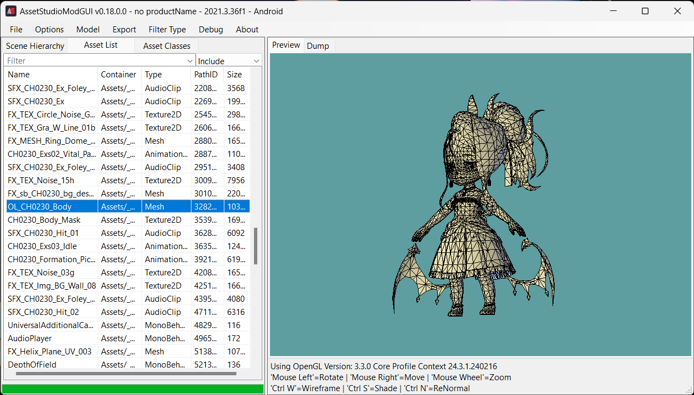

- Then you can view the extracted model using [Blender](https://www.blender.org)
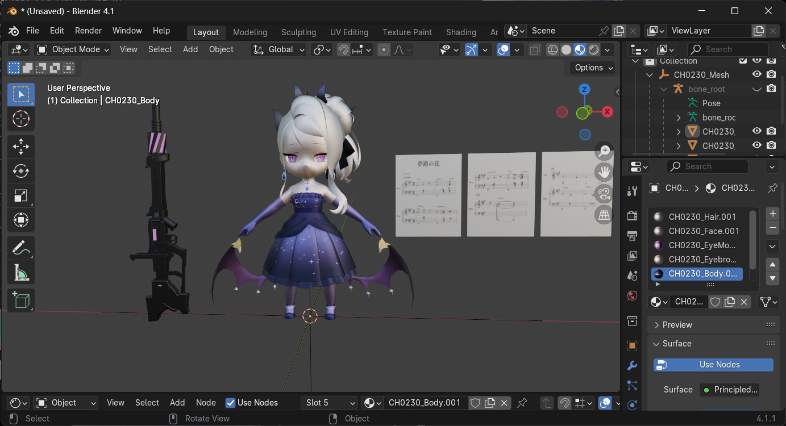

- Or you can convert the model to pmx to use with [MikuMikuDance](https://learnmmd.com)
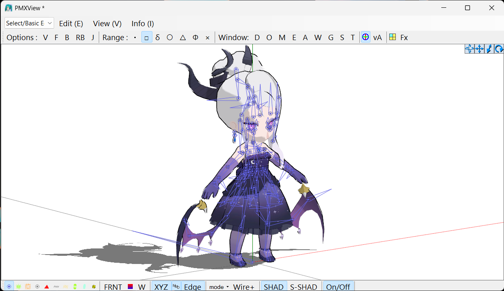

- Or you can port the model to [Source](https://en.wikipedia.org/wiki/Source_(game_engine)) to use with **Gmod** or **Source Film Maker**
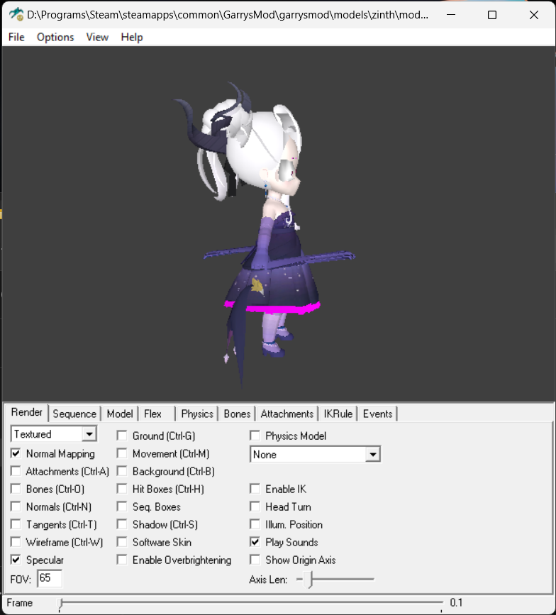
_I know it looks shit but it works_


2. You can use the extracted tablebundles to view the game database

- You can view the character dialog
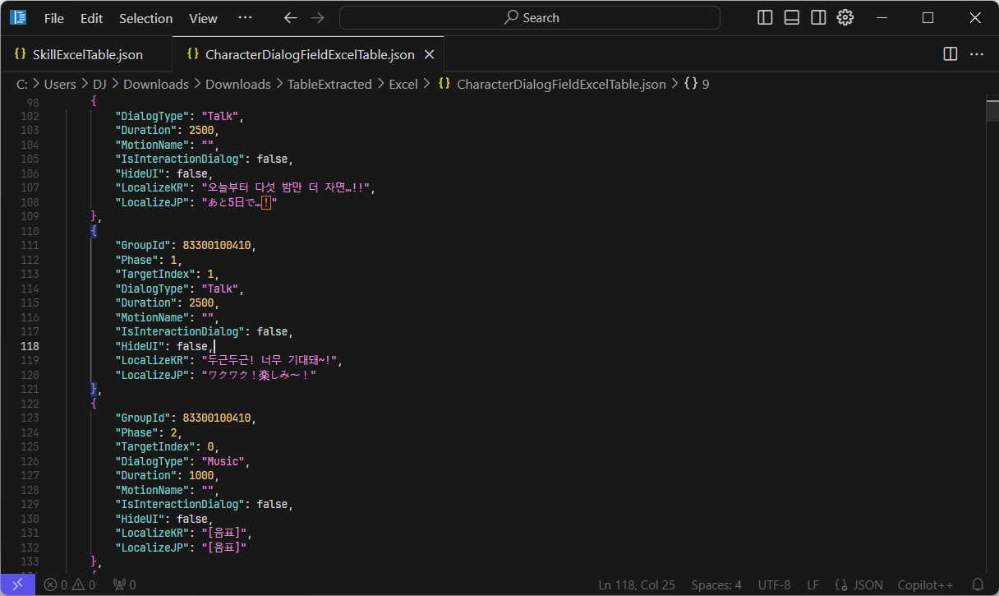

- You can view the charater skill info
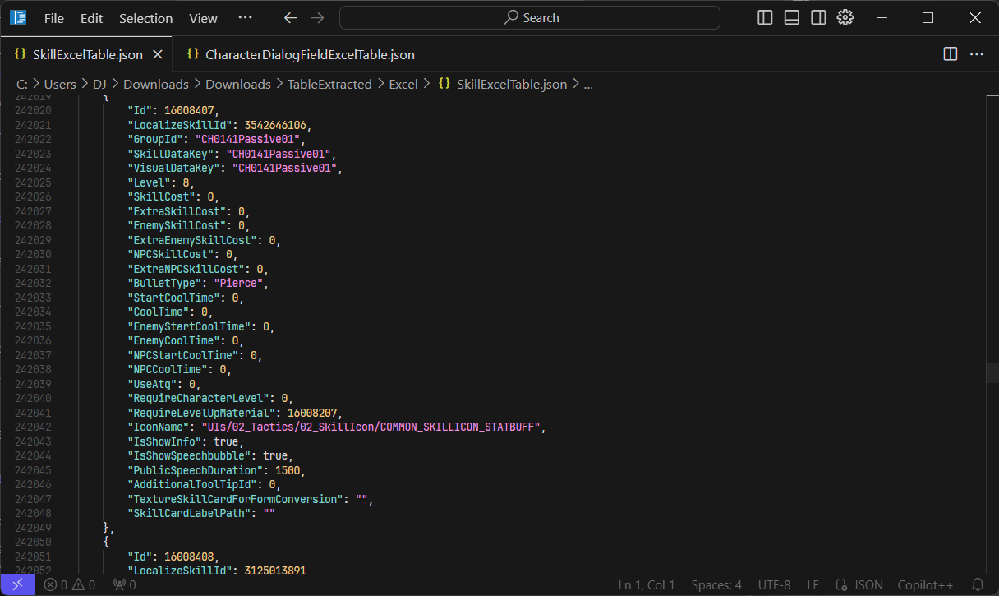


3. You can use the download media resources to view the game backgrounds, cg, video, or music

- You can view the game backgrounds and CG
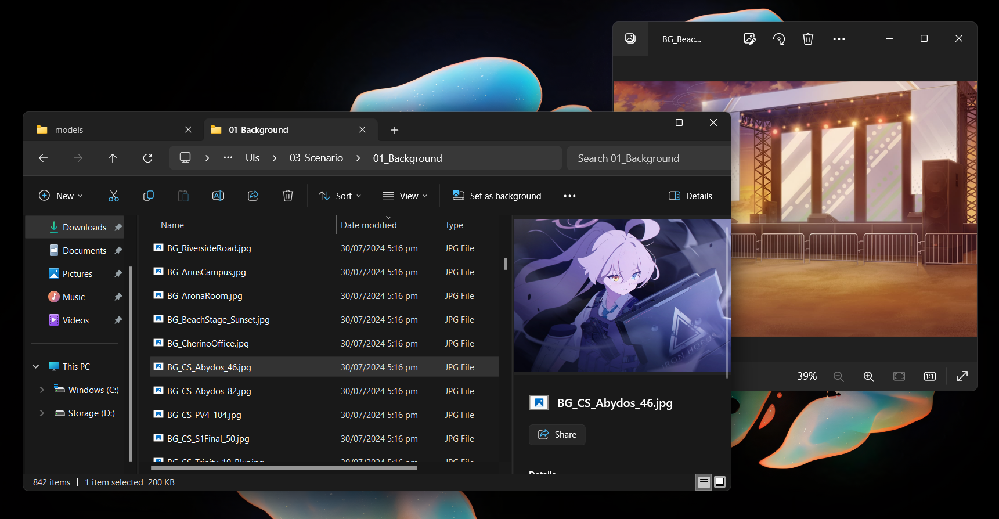

- You can listen character voice lines and ost
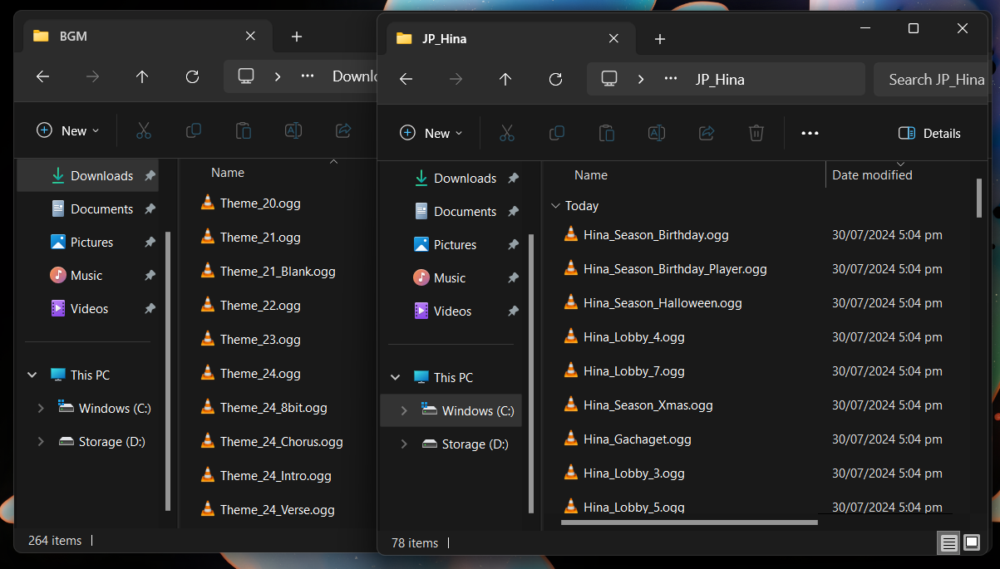

</details>

### Dump
To get `dump.cs` you need to manually decompile the `libil2cpp.so`. I recommend following the instructions from [Auto-Il2cppDumper](https://github.com/AndnixSH/Auto-Il2cppDumper) or [Zygisk-Il2CppDumper](https://github.com/Perfare/Zygisk-Il2CppDumper). Also I recommend using a emulator like **MuMuPlayer** to get easy root access.

But you your lazy you can use [Il2CppDumper](https://github.com/Perfare/Il2CppDumper) to dump it manually or automatically using a script. You gonna need the **Blue Archive JP** apk from [**ApkPure**](https://apkpure.com/blue-archive/com.YostarJP.BlueArchive), then rename .xapk to .zip and extract it. You will have multiple apks the apks you need is `config.arm64_v8a.apk` and `UnityDataAssetPack.apk` then rename .apk to .zip and extract it.

`libil2cpp.so` is located at extracted the `config.arm64_v8a.apk` then at `lib/arm64-v8a` and the `global-metadata.dat` is located at the extracted `UnityDataAssetPack.apk` then at `assets/bin/Data/Managed/Metadata`.

> [!NOTE]
> You will face a [ERROR: Can't use auto mode to process file, try manual mode](https://github.com/Perfare/Il2CppDumper?tab=readme-ov-file#error-cant-use-auto-mode-to-process-file-try-manual-mode) by doing this method.

### Contributing
Don't like my [shitty code](https://shitcode.net/latest/language/python) and what to change it? Feel free to contribute by submitting a pull request or issue. Always appreciate the help.

### Acknowledgement
 - [hdk5/MoeXCOM](https://github.com/hdk5/MoeXCOM)
 - [espectZ/blue-archive-viewer](https://github.com/respectZ/blue-archive-viewer)
 - [fiseleo/Blue-Archive-JP-Downloader](https://github.com/fiseleo/Blue-Archive-JP-Downloader)
 - [K0lb3/Blue-Archive---Asset-Downloader](https://github.com/K0lb3/Blue-Archive---Asset-Downloader)
 - [lwd-temp/blue-archive-spine-production](https://github.com/lwd-temp/blue-archive-spine-production)
 - [aelurum/AssetStudio](https://github.com/aelurum/AssetStudio)


### Copyright
**Blue Archive** is a registered trademark of NAT GAMES Co., Ltd., NEXON Korea Corp., and Yostar, Inc. This project is not affiliated with, endorsed by, or connected to NAT GAMES Co., Ltd., NEXON Korea Corp., NEXON GAMES Co., Ltd., Yostar, Inc., or any of their subsidiaries or affiliates. All game assets, content, and materials are copyrighted by their respective owners and are used for informational and educational purposes only.
